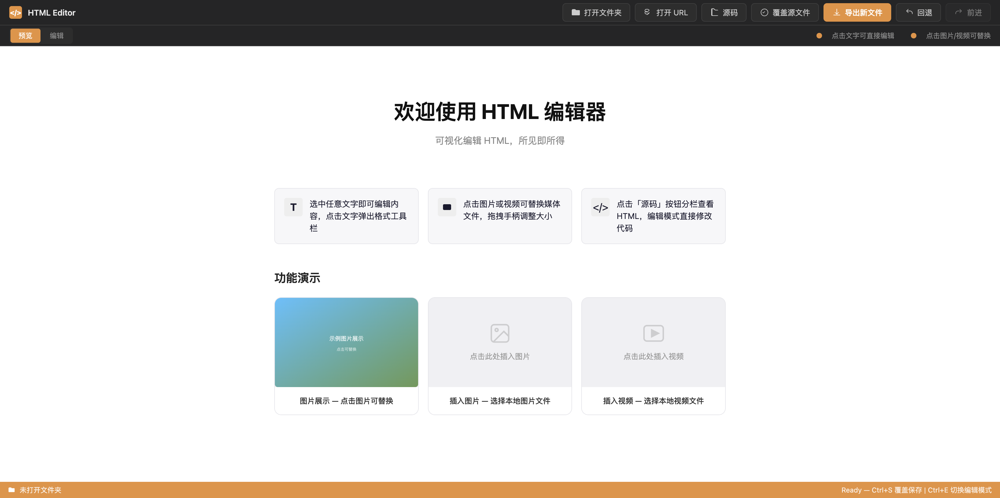
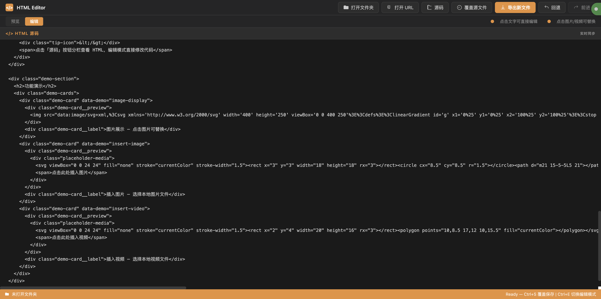
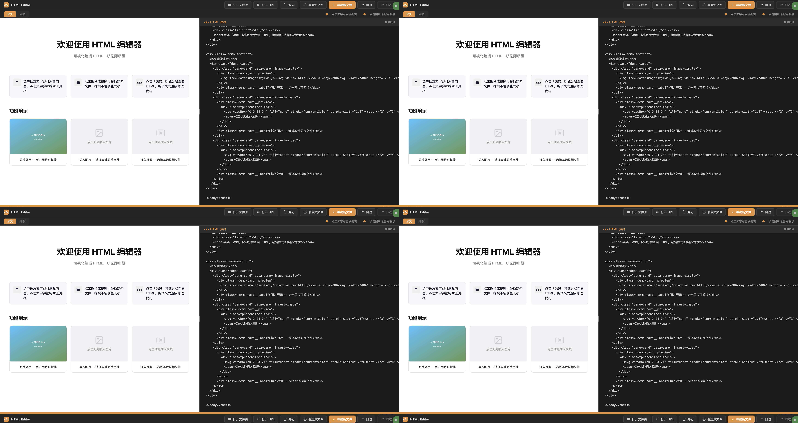
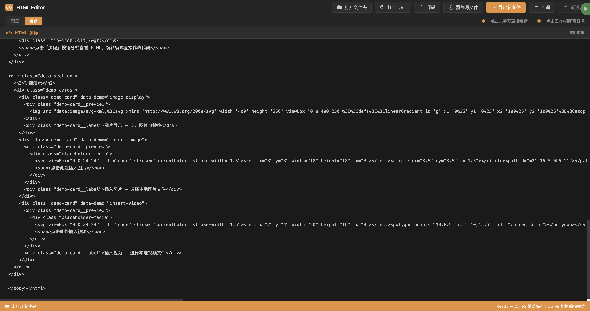
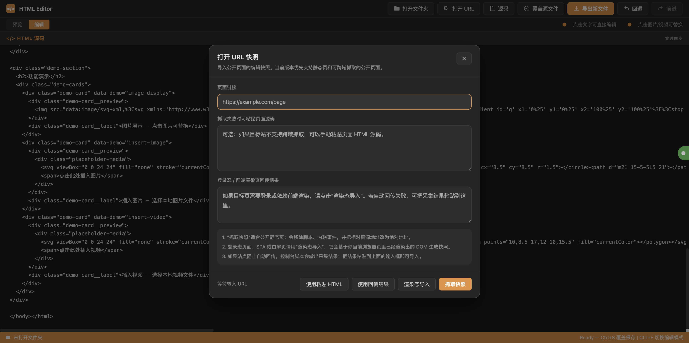
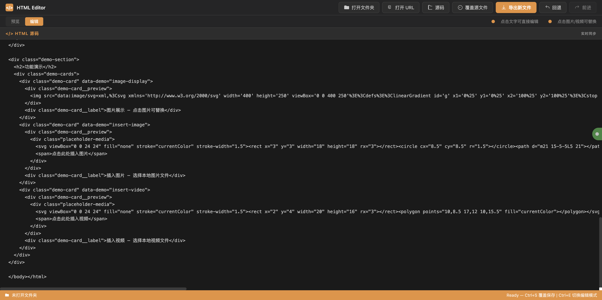
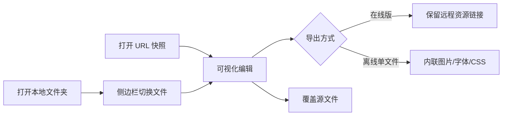

<p align="center">
  
</p>

<h1 align="center">HTML Editor</h1>
<p align="center"><strong>所见即所得 · 极致轻量 · 单文件即武器</strong></p>

<p align="center">
  
  
  
  
</p>

---

## ✨ 核心理念

**HTML Editor** 是一个**零依赖、纯原生**的 HTML 可视化编辑器。它只有一个文件，却能在浏览器里提供接近桌面 IDE 的编辑体验。

没有 `npm install`，没有 `node_modules`，没有 Webpack/Vite，没有任何运行时框架。一个 HTML 文件，双击打开，即开即用。

> *"Simplicity is the ultimate sophistication."* — Leonardo da Vinci

---

## 📸 界面预览

<p align="center">
  
  
</p>

<p align="center">
  
  
</p>

<p align="center">
  
  
</p>

<details>
<summary>🖱️ 点击展开截图说明</summary>

| 截图 | 展示内容 |
|---|---|
| **预览模式** | 默认欢迎页，所见即所得的页面预览效果 |
| **编辑模式** | 点击「编辑」后，文字区域高亮可编辑，提示栏切换为操作指引 |
| **源码分栏** | 点击「源码」后，左侧 HTML 源代码 + 右侧实时预览同步滚动 |
| **格式工具栏** | 编辑模式下选中文字，浮动弹出格式工具栏（加粗/斜体/链接等） |
| **URL 导入** | 输入远程页面 URL，支持自动抓取、粘贴源码、渲染态导入三种方式 |
| **分享导出** | 在线版（保留远程资源）与离线单文件版（内联资源）两种导出方式 |

</details>

---

## 🎯 能力矩阵

| 能力 | 描述 |
|---|---|
| 🔍 **可视化编辑** | 点击任意文字直接编辑，实时格式化工具栏浮动跟随 |
| 🖼️ **媒体替换** | 点击图片/视频即可替换本地文件，支持拖拽手柄缩放 |
| 📝 **源码分栏** | 左侧编辑 HTML 源码，右侧实时预览，改动即时反馈 |
| 🔄 **双模切换** | 预览模式 / 编辑模式一键切换，各司其职 |
| 📂 **文件夹工作区** | 打开本地文件夹，多 HTML 文件在侧边栏自由切换 |
| 🌐 **URL 快照** | 抓取远程公开页面，本地编辑后导出为新版本 |
| 🔐 **渲染态导入** | 支持登录态 / SPA 页面：通过浏览器控制台回传渲染结果 |
| 💾 **覆盖保存** | 对本地文件直接覆盖写入（File System Access API） |
| 📤 **双模导出** | 在线版（保留远程资源） / 离线单文件版（内联全部静态资源） |
| 🎨 **暗色主题** | 专业级深色工具主题，CSS 变量体系驱动 |
| ⌨️ **键盘快捷键** | `Ctrl+S` 覆盖保存 · `Ctrl+E` 切换编辑/预览模式 |
| 📐 **自适应布局** | Flexbox 驱动，编辑区 / 预览区 / 侧边栏弹性适配 |

---

## 🚀 快速开始

### 方式一：直接打开（推荐）

```bash
# 克隆仓库
git clone <your-repo-url>
cd htmlEditor

# 双击打开
open html-editor.html
```

浏览器即编辑器，无需任何构建步骤。

### 方式二：本地服务器

```bash
# 任意 HTTP 服务均可
python3 -m http.server 8080
# 访问 http://localhost:8080/html-editor.html
```

通过 HTTP 服务打开可获得更完整的跨域 URL 抓取能力。

---

## 🧭 工作流



### 四种典型场景

**场景一：本地页面编辑**
> 打开文件夹 → 侧边栏选中 HTML → 点击文字编辑 → `Ctrl+S` 保存 → 浏览器刷新看效果

**场景二：网页快照重建**
> 输入 URL → 自动抓取页面 → 本地编辑内容 → 导出离线单文件 → 发给同事直接打开

**场景三：多文件复合页面**
> 打开文件夹 → 自动识别多 HTML 文件 → 代码块标题可编辑 → 分栏查看源码与预览

**场景四：登录态页面采集**
> 浏览器打开目标页并登录 → F12 控制台粘贴采集脚本 → 回到编辑器点"渲染态导入" → 编辑导出

---

## 🏗️ 架构

```
html-editor.html  (~7800 行)
│
├── CSS Layer
│   ├── Design Tokens (CSS 变量)     — 颜色/间距/字体/圆角系统
│   ├── Reset & Base                 — 统一盒模型、自适应基础
│   ├── Menu Bar / Hint Bar          — 顶栏导航与模式切换
│   ├── Button / Dialog System       — 组件样式体系
│   ├── Editor Container             — 编辑区/预览区分栏布局
│   ├── File Sidebar                 — 文件列表与切换
│   ├── Toolbar (浮动格式栏)         — 选中文字后弹出的格式工具
│   └── Status Bar                   — 底部状态信息
│
├── HTML Layer
│   ├── 菜单栏                       — 打开/导出/源码分栏/URL导入
│   ├── 模式栏                       — 预览 ↔ 编辑切换
│   ├── 编辑器主体                   — 三栏: 侧边栏 | 源码 | 预览
│   ├── 状态栏                       — 路径 + 状态提示
│   └── 对话框                       — URL导入 / 分享导出 / 其他
│
└── JavaScript Layer
    ├── State Management              — 全局状态对象
    ├── File System API               — 本地文件读写
    ├── URL Fetch & Parse             — 远程页面抓取与解析
    ├── WYSIWYG Engine                — 可视化编辑核心
    ├── Export Engine                 — 在线版 & 离线单文件导出
    ├── Resource Inliner              — 远程资源 → Data URL 内联
    ├── Toolbar Controller            — 浮动格式工具栏
    ├── Multi-file Workspace          — 文件夹多文件管理
    └── Dialog Controller             — 对话框状态与交互
```

---

## 🛠️ 技术亮点

### 零依赖哲学

整个编辑器没有任何外部依赖。CSS 用原生变量系统驱动主题，JS 使用 File System Access API、Fetch API、Clipboard API 等现代浏览器原生能力，无需任何 polyfill 或框架。

### 离线单文件导出

离线导出引擎会遍历页面中所有远程资源——``、`<video>`、`<link>` 样式表、`url()` 中的背景图与字体——尝试通过 `fetch` + `canvas` / `FileReader` 将其转换为 Base64 Data URL 内联到 HTML 中。跨域资源自动跳过并给出详细报告。

### 渲染态导入

对于需要登录或依赖前端渲染的 SPA 页面，编辑器的"渲染态导入"功能会生成一段控制台脚本，用户在目标页执行后，脚本自动回传 DOM 结构与内联样式到编辑器。

### 文件系统深度集成

基于 File System Access API，支持打开整个文件夹、遍历 HTML 文件、直接覆盖保存，无需手动下载-编辑-上传的循环。

---

## 📋 浏览器兼容性

| 能力 | Chrome | Edge | Safari | Firefox |
|---|---|---|---|---|
| 可视化编辑 | ✅ | ✅ | ✅ | ✅ |
| 文件系统 API | ✅ | ✅ | ⚠️ 有限 | ❌ |
| URL 抓取 | ✅ | ✅ | ✅ | ✅ |
| 离线导出 | ✅ | ✅ | ✅ | ✅ |

> 文件系统 API 目前仅 Chromium 内核浏览器完整支持。Safari 与 Firefox 下仍可通过"打开文件"单文件编辑 + "导出新文件"保存。

---

## 🗺️ 路线图

- [ ] 历史撤销 / 重做（Undo / Redo）
- [ ] 图片裁剪与滤镜
- [ ] CSS 类名可视化编辑器
- [ ] 组件库（预设卡片、导航栏、Hero 区等）
- [ ] PWA 离线化
- [ ] 协作编辑（CRDT / WebSocket）
- [ ] 亮色主题

---

## 🤝 贡献

欢迎提交 Issue 和 Pull Request。本项目遵循 MIT 协议。

---

<p align="center">
  <sub>Made with ❤️ by builders, for builders.</sub>
</p>
